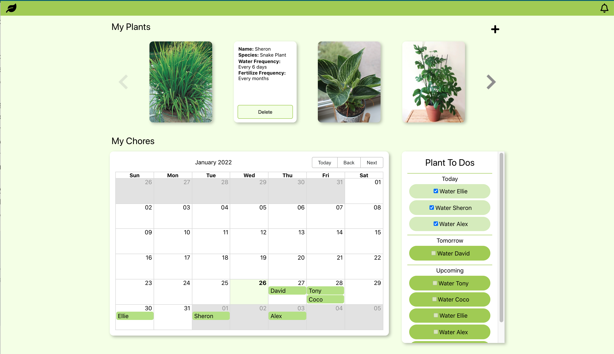

# Green Thumb Journal

Green Thumb Journal is a scheduling web application that allows plant lovers to store their individual plant information and dynamically render a watering schedule with provided calendar and to-do list.

  

